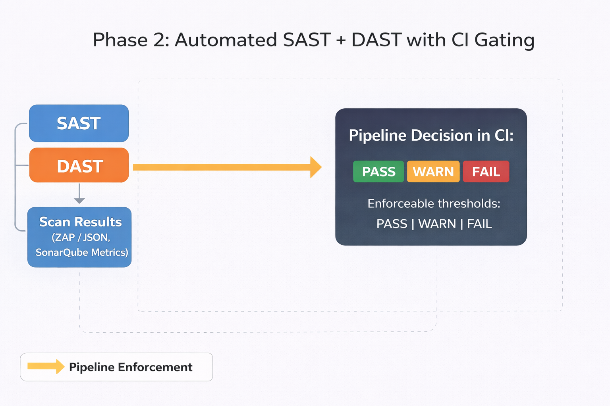
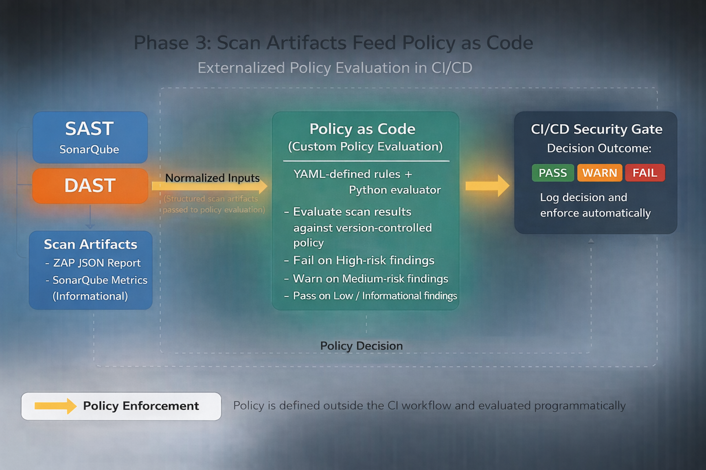

# SAST & DAST Security Assessment – OWASP Juice Shop

## Table of Contents

- [Summary](#summary)
- [What This Demonstrates](#what-this-demonstrates)
- [Target System](#target-system)
- [Tooling](#tooling)
- [Assessment Approach](#assessment-approach)
  - [Static Analysis (SAST)](#static-analysis-sast)
  - [Dynamic Analysis (DAST)](#dynamic-analysis-dast)
- [SAST vs DAST Comparison](#sast-vs-dast-comparison)
- [Key Findings (Executive View)](#key-findings-executive-view)
- [CI Evidence](#ci-evidence)
- [Phase 3 – Policy as Code Enforcement](#phase-3--policy-as-code-enforcement)
- [Security Engineering Takeaways](#security-engineering-takeaways)
- [Limitations](#limitations)
- [Disclaimer](#disclaimer)

## Summary
This project demonstrates a practical **application security assessment workflow** that combines static analysis (SAST) and dynamic analysis (DAST) to evaluate the OWASP Juice Shop application across both code-level and runtime attack surfaces.

The focus is not on tool usage alone, but on **how different testing methods surface different risk classes**, how findings are interpreted, and how remediation decisions are made.

---

## What This Demonstrates
- How SAST identifies insecure coding patterns independent of runtime reachability
- How DAST identifies runtime and configuration-level weaknesses
- Why SAST and DAST findings do not fully overlap
- How a security engineer prioritizes and explains remediation

---

## Target System
**OWASP Juice Shop**
- Frontend: Angular / TypeScript  
- Backend: Node.js  
- Deployment: Docker container  

The application is intentionally vulnerable to support security testing and analysis.

---

## Tooling
- **SonarQube (Community Edition)** – Static Application Security Testing
- **OWASP ZAP (Baseline Scan)** – Dynamic Application Security Testing
- **Docker** – Containerized execution for local and CI environments
- **GitHub Actions** – CI/CD orchestration for security scanning, policy evaluation, and enforcement

---

---
## Assessment Approach

### Static Analysis (SAST)
- Analyzed application source code for insecure patterns and security-sensitive constructs
- Identified confirmed security issues and security hotspots requiring manual review
- Established a baseline without modifying application code

**Evidence:**  
SAST findings are summarized in `SECURITY_SUMMARY.md`.  
Raw scan metadata is generated during CI execution and preserved as pipeline artifacts.

---

### Dynamic Analysis (DAST)
- Deployed the application in a containerized environment
- Performed a baseline, unauthenticated ZAP scan against the running service
- Identified runtime configuration and response-level weaknesses

**Evidence:**  
DAST reports are generated during CI execution and preserved as GitHub Actions artifacts.

---

## SAST vs DAST Comparison
A direct comparison was performed to evaluate coverage differences:

- Code-level issues (e.g., hard-coded secrets) identified only via SAST
- Runtime posture issues (e.g., missing security headers) identified only via DAST
- Limited overlap where static risks may or may not be exploitable at runtime

**Comparison and reasoning:**  
`evidence/analysis/overlap.md`

---

## Key Findings (Executive View)
Two representative vulnerabilities were selected to illustrate remediation thinking:

- **SAST:** Hard-coded credential pattern detected in source code  
- **DAST:** Missing Content Security Policy (CSP) header increasing XSS exposure  

Each finding includes impact, remediation strategy, and verification approach.

**See:**  
`SECURITY_SUMMARY.md`

---

## CI Evidence

This project includes a fully automated GitHub Actions pipeline that:
- Runs SAST with SonarQube
- Runs DAST with OWASP ZAP
- Applies a high-severity security gate based on DAST results
- Publishes security summaries and preserves scan artifacts for triage

Screenshots of successful pipeline execution are included in `/screenshots`.

Policy evaluation results are published alongside scan summaries to make enforcement decisions transparent and explainable.

---

## Phase 3 – Policy as Code Enforcement 

Phase 3 extends the CI/CD security pipeline by externalizing security enforcement logic into an explicit, version-controlled Policy as Code layer evaluated during CI execution. This phase demonstrates how security decisions can be defined, reviewed, and enforced independently of individual tools or pipeline implementation.

Rather than hard-coding enforcement logic directly into CI steps or relying solely on tool exit codes, enforcement thresholds are defined as version-controlled policy and evaluated programmatically during pipeline execution.

---

### Architecture Overview

The Phase 3 architecture separates security tooling, policy definition, and enforcement decision-making into distinct layers:

- **Security tools** (SonarQube and OWASP ZAP) generate structured security findings.
- **CI/CD orchestration** (GitHub Actions) executes scans and coordinates pipeline flow.
- **Policy as Code** defines explicit enforcement thresholds independent of CI logic and security tools.
- **Policy evaluation logic** applies policy rules to scan results and returns a deterministic decision.

This separation mirrors real-world DevSecOps patterns where security teams define guardrails and engineering teams execute against them without embedding policy directly into CI logic.

---

### Policy Design

Security enforcement rules are defined in a version-controlled policy file located in the `policy/` directory and evaluated programmatically during CI execution.

 The policy explicitly specifies:

- Which OWASP ZAP risk levels are considered blocking
- Which findings are permitted to pass
- Contextual constraints reflecting the intentionally vulnerable nature of the application

Only **HIGH-severity runtime findings** result in pipeline failure. Medium and lower severity findings are allowed to pass while remaining visible for triage and remediation planning.

This approach prioritizes runtime-exploitable risk while preserving developer velocity and providing an explicit, auditable enforcement decision.

---

### Policy Evaluation Flow

1. OWASP ZAP performs a baseline DAST scan against the running application.
2. ZAP generates a structured JSON report.
3. A policy evaluation script parses the report and applies enforcement rules defined in Policy as Code.
4. The pipeline enforces a pass, warn, or fail decision based on policy evaluation results.
5. Scan artifacts and enforcement decisions are preserved for transparency and auditability.
6. Scan artifacts used for policy evaluation are generated dynamically during CI execution and are not committed to source control.

The CI pipeline executes policy but does not define enforcement logic.

---

### Security Engineering Rationale

- Security enforcement logic is explicit, reviewable, and version-controlled.
- Policy remains independent of CI tooling and scanning implementations.
- Enforcement decisions are deterministic and explainable.
- The same policy model can be extended to additional security domains, including IaC, container security, and cloud guardrails.

This phase demonstrates how application security evolves from tool-driven scanning to policy-driven enforcement.

---

### NIST SP 800-53 Rev. 5 Alignment (Phase 3 Extension)

Phase 3 further supports alignment with the following control objectives:

- **RA-5 (Vulnerability Monitoring and Scanning):**  
  Runtime vulnerabilities are evaluated and enforced through automated policy decisions.

- **SA-11 (Developer Security Testing):**  
  Security testing results directly inform deployment decisions.

- **SI-2 (Flaw Remediation):**  
  High-risk findings are blocked prior to deployment.

- **SA-15 (Development Process, Standards, and Tools):**  
  Security enforcement is standardized through reusable policy.

- **CM-6 (Configuration Settings):**  
  Runtime configuration posture is continuously evaluated through DAST and policy enforcement.

---

## Security Engineering Takeaways
- No single testing technique provides complete coverage
- SAST excels at early detection of insecure patterns
- DAST validates runtime behavior and configuration
- Effective AppSec programs intentionally combine both

---

## Limitations
- SonarQube Community Edition uses an embedded database (lab use only)
- ZAP scan was baseline and unauthenticated
- Juice Shop is intentionally insecure and not representative of production posture

---

## Disclaimer
This project is for educational and demonstration purposes only.  
OWASP Juice Shop should never be deployed in production environments.
