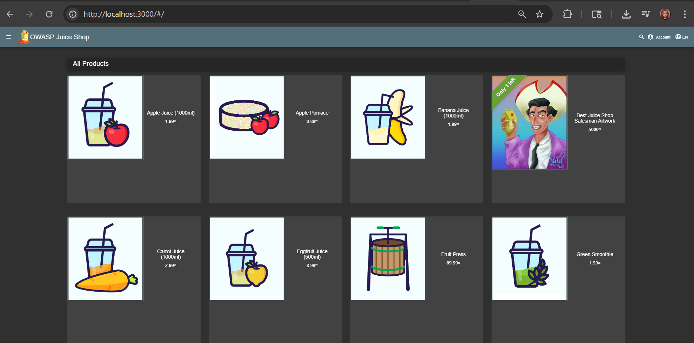
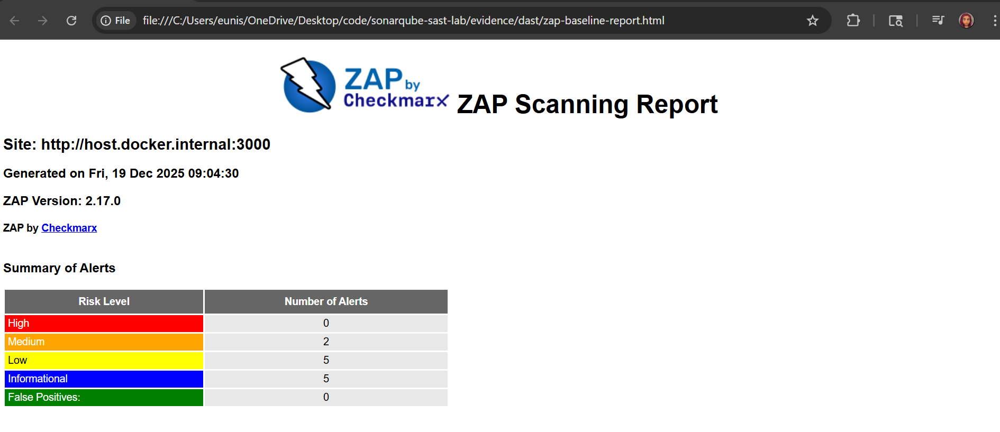
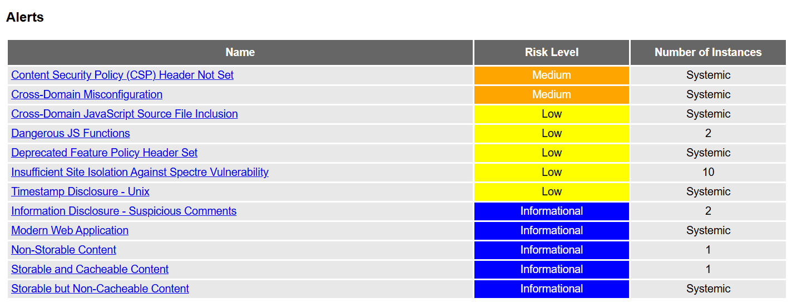
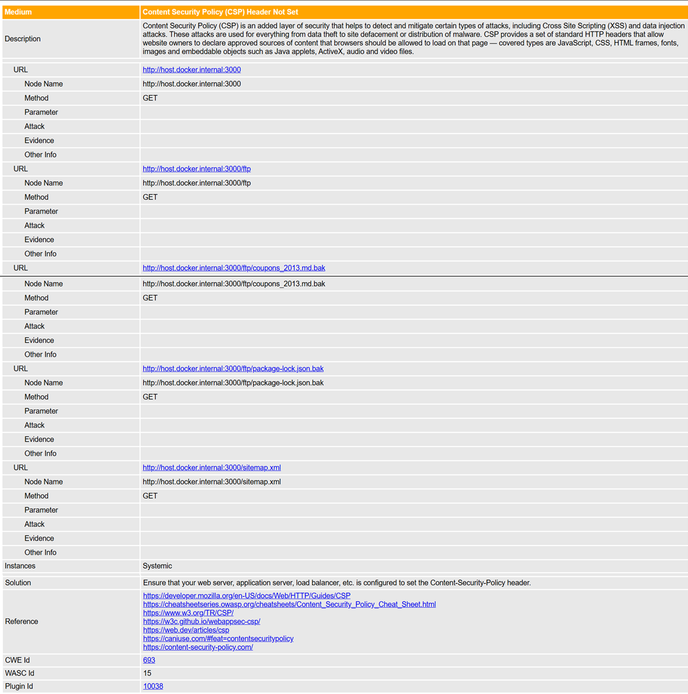
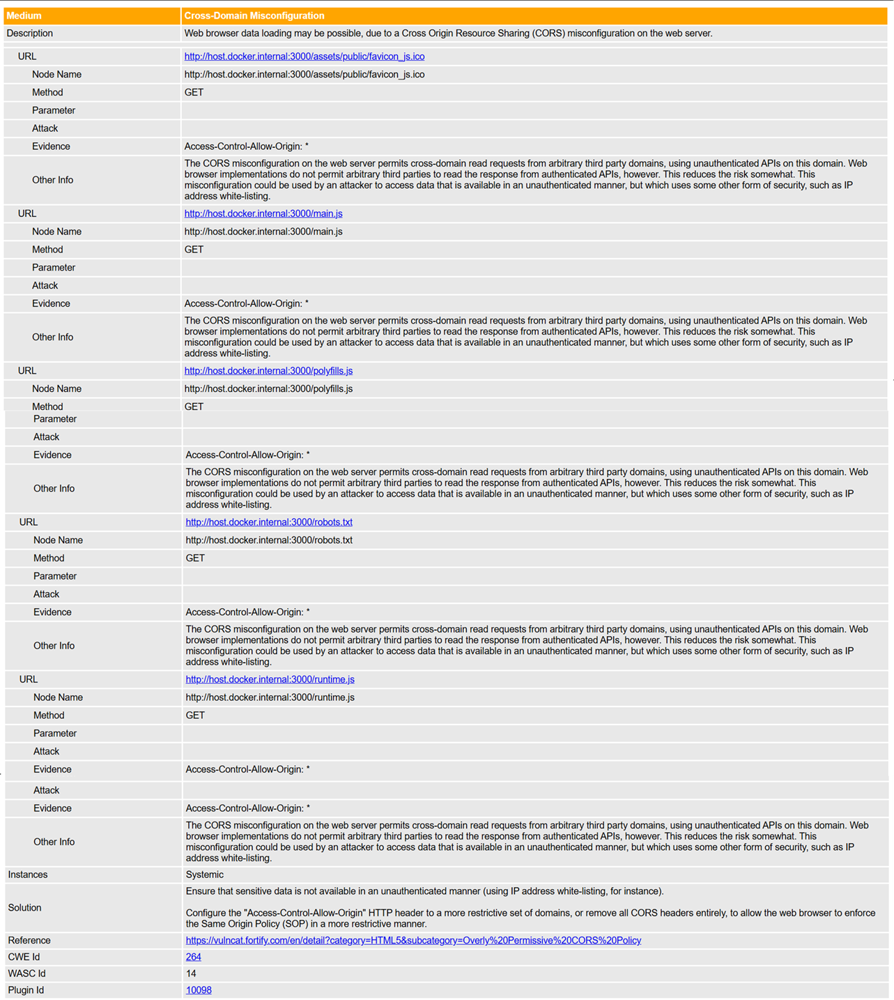

# DAST Evidence – OWASP ZAP

## Application Runtime Context

This screenshot shows the OWASP Juice Shop application running locally on port 3000. The application was deployed using Docker and served as the live target for the OWASP ZAP dynamic analysis scan. No application code was modified as part of this assessment.

Tool: OWASP ZAP (Baseline Scan)  
Target Application: OWASP Juice Shop  
Scan Type: Dynamic Application Security Testing (DAST)  
Scan Method: Containerized ZAP baseline scan  
Target URL: http://localhost:3000  

---

## 1. Scan Summary

The baseline scan identified:
- High: 0
- Medium: 2
- Low: 5
- Informational: 5

This scan focuses on passive and light active checks and is suitable for CI/CD and initial runtime validation.

---

## 2. Alerts Overview

Key findings include:
- Content Security Policy (CSP) header not set
- Cross-domain misconfiguration
- Use of dangerous JavaScript functions
- Information disclosure and caching-related observations

---

## 3. Medium Risk Finding – CSP Header Not Set

**Description**  
The application does not set a Content-Security-Policy header, which increases exposure to client-side attacks such as Cross-Site Scripting (XSS).

**Risk**  
Without CSP, injected scripts or malicious third-party resources are more likely to execute in the browser.

**Recommended Mitigation**
- Define and enforce a strict CSP header
- Limit allowed script, style, and frame sources
- Test policy effectiveness using report-only mode before enforcement

---

## 4. Medium Risk Finding – Cross-Domain Misconfiguration

**Description**  
The application allows cross-domain interactions that may not be sufficiently restricted.

**Risk**  
Improper cross-origin configuration can enable data leakage or unauthorized access from untrusted origins.

**Recommended Mitigation**
- Restrict allowed origins using explicit allowlists
- Review CORS configuration on API endpoints
- Avoid wildcard origins for authenticated requests

---

## Notes
- This was a baseline DAST scan without authentication.
- Findings represent runtime behavior and HTTP response posture.
- Some risks identified by SAST may not appear in DAST if code paths are not reachable during scanning.
