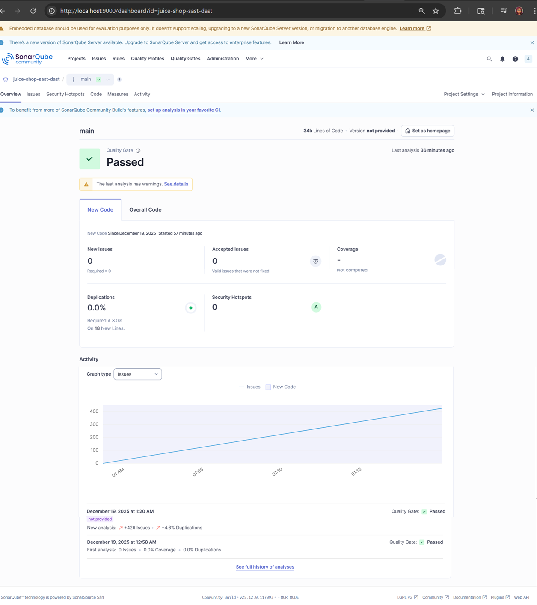
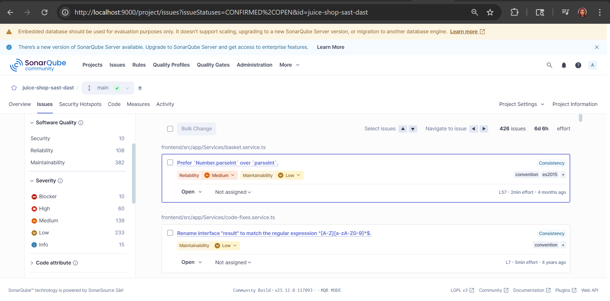
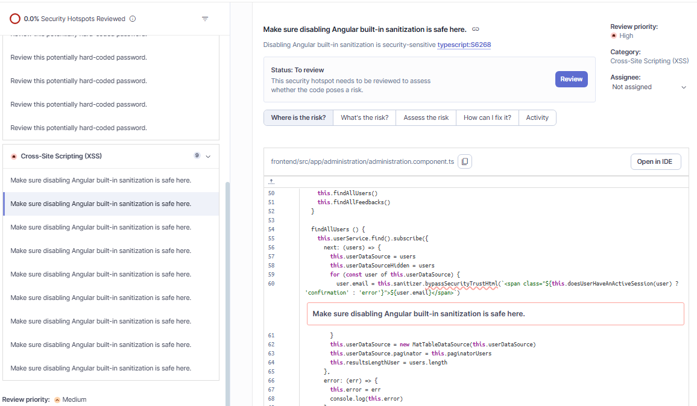

# SAST Evidence – SonarQube

Tool: SonarQube Community Edition  
Target Application: OWASP Juice Shop  
Scan Type: Static Application Security Testing (SAST)  
Scan Method: Containerized SonarScanner CLI  
Scan Scope: frontend/src, lib, routes

---

## 1. Project Overview

This screenshot shows:
- ~34k lines of code analyzed
- Security issues and security hotspots identified
- Baseline scan of existing code (no new code enforcement)

---

## 2. Issues Summary

This view shows:
- Total issues detected across security, reliability, and maintainability
- Severity distribution used to prioritize remediation
- Confirmation that findings are code-level, not runtime

---

## 3. Security Hotspot – Hard-coded Password (typescript:S2068)

This hotspot flags a potential hard-coded secret in source code.
- Category: Authentication
- Risk: Credential exposure and reuse
- Requires manual review to confirm exploitability

---

## 4. Security Hotspot – Sanitization Bypass Risk (typescript:S6268)

This hotspot highlights code that bypasses Angular’s built-in sanitization.
- Category: Cross-Site Scripting (XSS)
- Risk depends on whether user-controlled data reaches this path
- Candidate for runtime validation during DAST

---

## Notes
- Findings represent static analysis only.
- No code changes were made; this scan establishes a security baseline.
- Some issues may not be reachable at runtime and require DAST validation.
